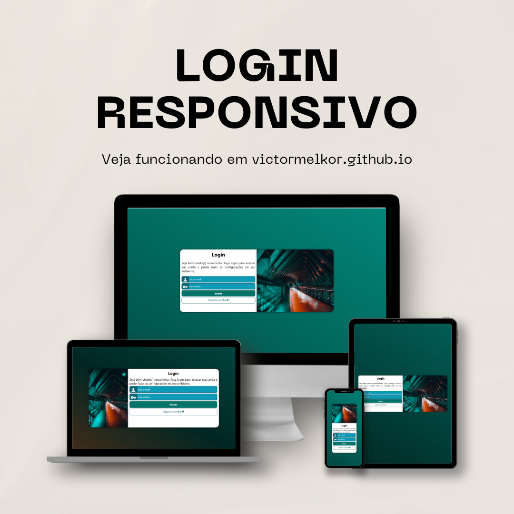

# 🧩 Tela de Login Responsiva

Tela de login moderna, personalizada e **totalmente responsiva**, desenvolvida com foco em **design limpo**, **adaptação a diferentes tamanhos de tela** e **estrutura modular**. Ideal para uso em projetos web que exigem uma interface de autenticação simples e funcional.

---

## 📱 Demonstração

➡️ Acesse aqui: [https://victormelkor.github.io/login-responsivo](https://victormelkor.github.io/login-responsivo)

[](https://victormelkor.github.io/login-responsivo)


---

## 🛠️ Tecnologias Utilizadas

<p align="left">
  
  
</p>

---

## 📂 Estrutura do Projeto
```
/login-responsivo
│
├── index.html
├── style.css
├── media-query.css
├── login.jpg
├── README.md
```


---

## 📌 Recursos

- Layout centralizado e responsivo
- Animação de fundo com gradiente
- Design limpo e moderno
- Compatível com telas grandes e pequenas

---

## 🚀 Como Visualizar Localmente

1. Clone o repositório:
   ```bash
   git clone https://github.com/victormelkor/login-responsivo.git

2. Abra o index.html no seu navegador.

## 📄 Licença
Este projeto está sob a licença MIT — sinta-se à vontade para usar e adaptar.

## 📬 Contato
Entre em contato ou siga:

<p align="left"> <a href="https://linkedin.com/in/victormelkor" target="_blank">  </a> <a href="mailto:victor.melkor@gmail.com" target="_blank">  </a> </p> 
